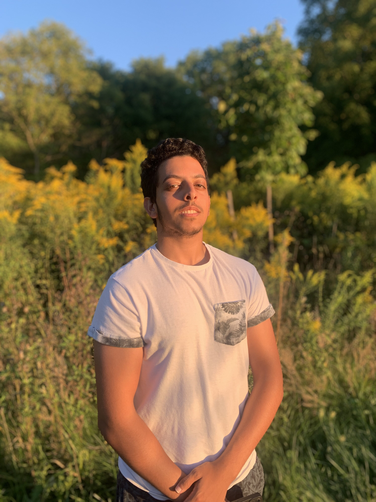

# Mohamed's Portfolio 
Portfolio website made throughout the year of 2023

This was a website built to showcase my technical skills, web design skills, and last but not least my creativity as a Creative Developer

## Project timeline and technologies used

Build a website to ahowcase what you are and what you have worked/working on

### Technologies Used

<<<<<<< Updated upstream
* HTML5
* CSS3
* JavaScript 
* SCSS (Sass)
* Git
=======
**[Instagram]:** [Link to Instagram]
**[Twitter]:** [Link to Twitter]
**[Facebook]:** [Link to Facebook]

 

### Team Members:

Mohamed H Zarandah: 
    
    
    {Roles: "Product Design | Web Design/Development | Content Management | Editor",

    Description: "Moh is an imaginative individual with a passion for creativity. During his early education, he dedicated his time to design and visual arts, fostering a deep appreciation for Visual Media and Communications. Now a Student of Interactive Media Design at Fanshawe College, Mohamed is the Creative Director / Team Leader / CEO of MHZ", },

<be>

## Reach Out!

If you find me good enough for your needs, Reach out by email, and don't forget to follow me on [Instagram], [Twitter], and [Facebook] for updates.

 

## Contributing
* Photoshop
* Cinema4d
* Illustrator
* After Effects
* Visual Studio Code
>>>>>>> Stashed changes
* GitHub
* Node JS
